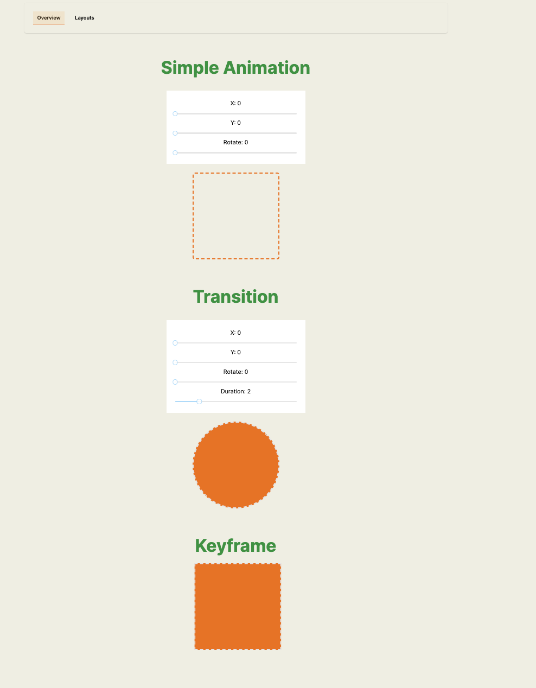
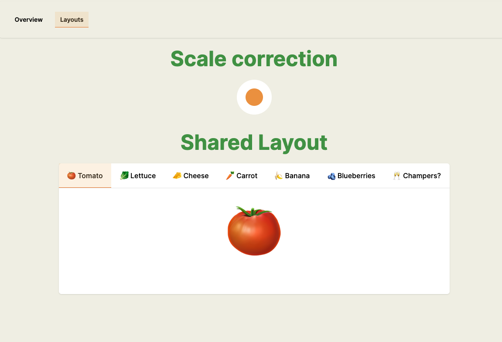

# Framer Motion with Next.js

A project for learning and implementing Framer  Motion with Next.js.

## Table of Contents

- [Introduction](#introduction)
- [Getting Started](#getting-started)
- [Usage](#usage)
- [Folder Structure](#folder-structure)
- [Contributing](#contributing)
- [License](#license)

## Introduction

This project is designed to help you learn and implement Framer  Motion using
Next.js. Framer  Motion is a library for creating smooth animations and
transitions in your web applications.

## Getting Started

Follow these steps to get the project up and running on your local machine:

1. Clone the repository:

      ```bash
      git clone https://github.com/yourusername/Framer-motion.git
      cd Framer -motion-nextjs
      ```

2. Install dependencies:

      ```bash
      npm install
      ```

3. Start the development server:

      ```bash
      npm run dev
      ```

4. Open your web browser and go to `http://localhost:3000` to see the project in
   action.

## Usage

In this section, provide some examples of how to use Framer  Motion in your
Next.js project. Include code snippets, explanations, and any specific
configurations that are necessary.

```javascript
import { motion } from "framer-motion";

// Use motion components in your Next.js pages
const MyComponent = () => (
	<motion.div
		initial={{ opacity: 0 }}
		animate={{ opacity: 1 }}
		exit={{ opacity: 0 }}
	>
		This is a Framer  Motion component.
	</motion.div>
);
```

## Folder Structure

Explain the folder structure of your project. This can help users navigate and
understand where different components, styles, or other assets are located.

```
- /app
  - page.tsx
- /components
  - MyComponent.ts
- /styles
  - styles.css
```

## Works samples:

 
